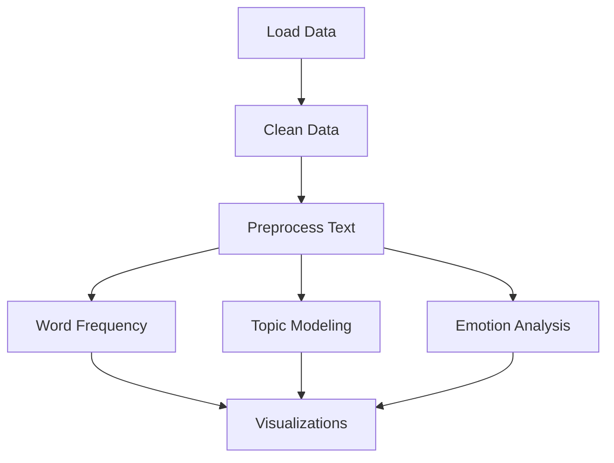

# Architecture Refactoring Suggestions

This document outlines recommendations for improving the architecture of the Gym Review Analysis project. These are suggestions for future development and require design decisions based on your specific needs.

## Table of Contents
1. [Separation of Concerns](#separation-of-concerns)
2. [Data Schema Abstraction](#data-schema-abstraction)
3. [Test Coverage Expansion](#test-coverage-expansion)
4. [CI/CD Pipeline](#cicd-pipeline)
5. [Documentation Improvements](#documentation-improvements)
6. [Performance Optimizations](#performance-optimizations)
7. [API Design](#api-design)

---

## 1. Separation of Concerns

### Current State
The `GymReviewAnalyzer` class handles multiple responsibilities:
- Data loading and validation
- Text preprocessing
- Statistical analysis
- Machine learning (topic modeling, emotion analysis)
- Visualization
- File I/O

### Recommendation: Multi-Class Architecture

Consider refactoring into specialized classes:

```python
# Data layer
class DataLoader:
    """Handles loading data from various sources"""
    def load_from_excel(self, path: Path) -> pd.DataFrame
    def load_from_url(self, url: str) -> pd.DataFrame
    def load_from_csv(self, path: Path) -> pd.DataFrame

class DataValidator:
    """Validates data structure and quality"""
    def validate_schema(self, df: pd.DataFrame, schema: DataSchema) -> bool
    def check_data_quality(self, df: pd.DataFrame) -> DataQualityReport

# Processing layer
class TextPreprocessor:
    """Handles all text preprocessing"""
    def __init__(self, terms_to_remove: List[str], min_token_length: int = 2)
    def preprocess(self, text: str) -> str
    def batch_preprocess(self, texts: List[str]) -> List[str]

# Analysis layer
class FrequencyAnalyzer:
    """Analyzes word frequencies"""
    def analyze(self, texts: List[str]) -> FreqDist
    def get_top_n(self, n: int) -> List[Tuple[str, int]]

class TopicAnalyzer:
    """Handles topic modeling"""
    def __init__(self, method: str = 'bertopic')  # or 'lda'
    def fit(self, documents: List[str]) -> TopicModel
    def transform(self, documents: List[str]) -> List[int]

class EmotionAnalyzer:
    """Handles emotion classification"""
    def __init__(self, model_name: str = "bhadresh-savani/bert-base-uncased-emotion")
    def classify(self, texts: List[str]) -> List[str]
    def classify_batch(self, texts: List[str], batch_size: int = 32) -> List[str]

# Visualization layer
class Visualizer:
    """Creates all visualizations"""
    def plot_frequency(self, freq_dist: FreqDist, title: str, filename: str)
    def create_wordcloud(self, text: str, filename: str, **kwargs)
    def plot_emotions(self, emotions: List[str], filename: str)

# Orchestration layer
class AnalysisPipeline:
    """Orchestrates the complete analysis workflow"""
    def __init__(self, config: AnalysisConfig)
    def run(self) -> AnalysisResults
```

### Pros:
- Easier to test individual components
- Better code reusability
- Clear responsibilities
- Easier to extend and maintain

### Cons:
- More complex initial setup
- More files to manage
- Potential for over-engineering simple use cases

### Decision Point:
**Use single-class approach if:**
- Project remains small (<1000 lines)
- Only used for simple analyses
- Few contributors

**Use multi-class approach if:**
- Planning to add more features
- Multiple team members working on different components
- Need to reuse components in other projects

---

## 2. Data Schema Abstraction

### Current State
Column names are hardcoded with some configurability through constructor parameters.

### Recommendation: Configuration-Based Schema

Create a flexible schema system:

```python
from dataclasses import dataclass
from typing import Dict, Optional

@dataclass
class DataSchema:
    """Defines the schema for review data"""
    text_column: str
    score_column: str
    location_column: str
    date_column: Optional[str] = None
    reviewer_column: Optional[str] = None

    def validate(self, df: pd.DataFrame) -> bool:
        """Validate that DataFrame matches this schema"""
        required = [self.text_column, self.score_column, self.location_column]
        return all(col in df.columns for col in required)

# Configuration file approach (YAML or JSON)
# config.yaml
data_sources:
  google:
    schema:
      text_column: "Comment"
      score_column: "Overall Score"
      location_column: "Club's Name"
    score_range: [1, 5]

  trustpilot:
    schema:
      text_column: "Review Content"
      score_column: "Review Stars"
      location_column: "Location Name"
    score_range: [1, 5]

# Usage
schemas = load_schemas('config.yaml')
google_schema = DataSchema(**schemas['google']['schema'])
```

### Pros:
- Support multiple data sources easily
- External configuration without code changes
- Easier to add new review platforms

### Cons:
- Additional dependency (YAML parser)
- More configuration to manage

### Decision Point:
**Stick with current approach if:**
- Only using Google and Trustpilot reviews
- Schema unlikely to change

**Use configuration approach if:**
- Planning to support multiple review platforms
- Different clients with different data formats
- Need runtime schema changes

---

## 3. Test Coverage Expansion

### Current State
~30% test coverage, mostly unit tests for basic functionality.

### Recommendations

#### A. Increase Unit Test Coverage

Target areas needing tests:
```python
# Missing tests for:
- Topic modeling functions (_run_bertopic, _run_lda)
- Emotion analysis
- Visualization methods
- Edge cases (empty dataframes, single review, etc.)
- Error paths
```

#### B. Add Integration Tests

```python
class TestFullPipeline(unittest.TestCase):
    """Test complete analysis workflows"""

    def test_end_to_end_with_real_data(self):
        """Test with actual (small) dataset"""

    def test_pipeline_with_no_negative_reviews(self):
        """Test graceful handling when all reviews are positive"""

    def test_pipeline_with_mixed_languages(self):
        """Test language filtering"""
```

#### C. Add Mock-Based Tests

```python
@patch('transformers.pipeline')
def test_emotion_analysis_with_mock(self, mock_pipeline):
    """Test emotion analysis without loading actual model"""
    mock_pipeline.return_value = MagicMock(return_value=[{'label': 'joy'}])
    # Test logic without heavy ML model loading
```

#### D. Add Performance Tests

```python
def test_large_dataset_performance(self):
    """Ensure analysis completes within reasonable time"""
    large_data = generate_reviews(count=10000)
    start = time.time()
    analyzer.analyze(large_data)
    duration = time.time() - start
    self.assertLess(duration, 60)  # Should complete in under 60s
```

### Target Coverage:
- **Minimum**: 70% line coverage
- **Recommended**: 85% line coverage
- **Stretch goal**: 95% line coverage

---

## 4. CI/CD Pipeline

### Recommendation: GitHub Actions Workflow

Create `.github/workflows/ci.yml`:

```yaml
name: CI

on: [push, pull_request]

jobs:
  test:
    runs-on: ubuntu-latest
    strategy:
      matrix:
        python-version: [3.8, 3.9, "3.10", "3.11"]

    steps:
    - uses: actions/checkout@v2

    - name: Set up Python
      uses: actions/setup-python@v2
      with:
        python-version: ${{ matrix.python-version }}

    - name: Install dependencies
      run: |
        pip install -r requirements.txt
        pip install pytest pytest-cov

    - name: Run tests
      run: pytest tests/ --cov=src --cov-report=xml

    - name: Upload coverage
      uses: codecov/codecov-action@v2
      with:
        file: ./coverage.xml

  lint:
    runs-on: ubuntu-latest
    steps:
    - uses: actions/checkout@v2
    - name: Set up Python
      uses: actions/setup-python@v2
      with:
        python-version: 3.9
    - name: Install linting tools
      run: pip install black flake8 mypy
    - name: Run black
      run: black --check src/ tests/
    - name: Run flake8
      run: flake8 src/ tests/
    - name: Run mypy
      run: mypy src/

  security:
    runs-on: ubuntu-latest
    steps:
    - uses: actions/checkout@v2
    - name: Run security scan
      run: |
        pip install safety bandit
        safety check
        bandit -r src/
```

### Additional CI/CD Features:

1. **Pre-commit Hooks** (`.pre-commit-config.yaml`):
```yaml
repos:
  - repo: https://github.com/psf/black
    rev: 22.10.0
    hooks:
      - id: black

  - repo: https://github.com/pycqa/flake8
    rev: 5.0.4
    hooks:
      - id: flake8

  - repo: https://github.com/pre-commit/mirrors-mypy
    rev: v0.991
    hooks:
      - id: mypy
```

2. **Automated Release** - Create releases on tag push
3. **Documentation Generation** - Auto-build and deploy docs
4. **Dependency Updates** - Dependabot for security updates

---

## 5. Documentation Improvements

### A. API Documentation (Sphinx)

Setup:
```bash
pip install sphinx sphinx-rtd-theme sphinx-autodoc-typehints
mkdir docs
cd docs
sphinx-quickstart
```

Configure `docs/conf.py`:
```python
extensions = [
    'sphinx.ext.autodoc',
    'sphinx.ext.napoleon',
    'sphinx.ext.viewcode',
    'sphinx_autodoc_typehints',
]
```

### B. Usage Examples

Create `examples/` directory:
```
examples/
├── basic_usage.py
├── custom_preprocessing.py
├── topic_modeling_comparison.py
├── emotion_analysis_deep_dive.py
└── performance_optimization.py
```

### C. Interactive Documentation

Consider Jupyter Book for interactive docs:
```bash
pip install jupyter-book
jupyter-book create docs/
jupyter-book build docs/
```

### D. Architecture Diagrams

Use tools like:
- **Mermaid** for inline diagrams in markdown
- **diagrams.net** (draw.io) for complex diagrams
- **PlantUML** for UML diagrams

Example Mermaid diagram:


---

## 6. Performance Optimizations

### A. Streaming for Large Datasets

```python
class StreamingAnalyzer:
    """Process reviews in chunks to handle large datasets"""

    def analyze_in_chunks(self, file_path: Path, chunk_size: int = 1000):
        for chunk in pd.read_csv(file_path, chunksize=chunk_size):
            yield self.process_chunk(chunk)
```

### B. Parallel Processing

```python
from multiprocessing import Pool
from functools import partial

def parallel_preprocess(texts: List[str], n_jobs: int = -1) -> List[str]:
    """Preprocess texts in parallel"""
    if n_jobs == -1:
        n_jobs = cpu_count()

    with Pool(n_jobs) as pool:
        return pool.map(preprocess_text, texts)
```

### C. Caching Results

```python
from functools import lru_cache
from joblib import Memory

# Option 1: In-memory cache
@lru_cache(maxsize=1000)
def preprocess_text_cached(text: str) -> str:
    return preprocess_text(text)

# Option 2: Disk cache
memory = Memory("./cache", verbose=0)

@memory.cache
def run_topic_modeling_cached(texts_hash: str, params: dict):
    # Hash texts to use as cache key
    return run_topic_modeling(texts, **params)
```

### D. Database Backend

For very large datasets, consider SQLite or PostgreSQL:

```python
class DatabaseAnalyzer:
    """Analyzer that works with database backend"""

    def __init__(self, db_path: str):
        self.conn = sqlite3.connect(db_path)

    def load_reviews_query(self, query: str) -> pd.DataFrame:
        return pd.read_sql(query, self.conn)

    def analyze_negative_reviews(self):
        query = """
            SELECT text, score, location
            FROM reviews
            WHERE score < 3
        """
        return self.load_reviews_query(query)
```

---

## 7. API Design

### Option A: REST API (Flask/FastAPI)

```python
from fastapi import FastAPI, UploadFile, File
from pydantic import BaseModel

app = FastAPI()

class AnalysisRequest(BaseModel):
    negative_threshold: int = 3
    use_bertopic: bool = True

@app.post("/analyze")
async def analyze_reviews(
    google_file: UploadFile = File(...),
    trustpilot_file: UploadFile = File(...),
    config: AnalysisRequest = AnalysisRequest()
):
    analyzer = GymReviewAnalyzer(
        negative_threshold=config.negative_threshold
    )
    # Process files and return results
    return {"status": "complete", "insights": insights}

@app.get("/health")
async def health_check():
    return {"status": "healthy"}
```

### Option B: CLI Tool (Click)

```python
import click

@click.group()
def cli():
    """Gym Review Analysis CLI"""
    pass

@cli.command()
@click.option('--google', type=click.Path(exists=True), help='Google reviews file')
@click.option('--trustpilot', type=click.Path(exists=True), help='Trustpilot reviews file')
@click.option('--output', type=click.Path(), help='Output directory')
@click.option('--threshold', default=3, help='Negative review threshold')
def analyze(google, trustpilot, output, threshold):
    """Run complete analysis"""
    analyzer = GymReviewAnalyzer(negative_threshold=threshold)
    analyzer.load_data(google, trustpilot)
    analyzer.run_complete_analysis()
    click.echo("Analysis complete!")

if __name__ == '__main__':
    cli()
```

### Option C: Web Interface (Streamlit)

```python
import streamlit as st

st.title("Gym Review Analysis")

uploaded_google = st.file_uploader("Upload Google Reviews", type=['xlsx', 'csv'])
uploaded_tp = st.file_uploader("Upload Trustpilot Reviews", type=['xlsx', 'csv'])

threshold = st.slider("Negative Review Threshold", 1, 5, 3)

if st.button("Run Analysis"):
    with st.spinner("Analyzing..."):
        analyzer = GymReviewAnalyzer(negative_threshold=threshold)
        # Load and analyze
        st.success("Analysis complete!")

        # Display results
        st.subheader("Word Frequencies")
        st.image("google_freq.png")

        st.subheader("Emotions")
        st.image("emotion_distribution.png")
```

---

## Summary of Decision Matrix

| Feature | Complexity | Benefit | Priority | Recommended If |
|---------|-----------|---------|----------|----------------|
| Multi-class architecture | High | High | Medium | Growing team, expanding features |
| Data schema abstraction | Medium | Medium | Low | Multiple data sources |
| Test coverage expansion | Medium | High | **High** | Production use |
| CI/CD pipeline | Low | High | **High** | Team collaboration |
| API documentation | Low | Medium | Medium | External users |
| Performance optimization | High | Medium | Low | Large datasets (>100K reviews) |
| REST API | Medium | High | Medium | Web integration needed |
| CLI tool | Low | Medium | Low | Power users, automation |
| Web interface | Low | High | Medium | Non-technical users |

---

## Next Steps

### Immediate (Week 1):
1. Set up CI/CD pipeline with GitHub Actions
2. Expand test coverage to 70%
3. Add API documentation with docstrings

### Short-term (Month 1):
4. Create usage examples
5. Add performance profiling
6. Consider CLI tool for ease of use

### Long-term (Quarter 1):
7. Evaluate architecture refactoring needs
8. Add database support if needed
9. Create web interface if appropriate

---

## Questions to Consider

Before implementing these suggestions, consider:

1. **Who is the primary user?**
   - Yourself (simple approach)
   - Your team (moderate complexity)
   - External users (full API/docs)

2. **What is the expected data scale?**
   - <10K reviews (current approach fine)
   - 10K-100K reviews (add batching)
   - >100K reviews (need database)

3. **How will this be deployed?**
   - Local script (keep simple)
   - Server deployment (add API)
   - Cloud service (containerize, add monitoring)

4. **What is the maintenance commitment?**
   - One-time analysis (minimal changes)
   - Regular updates (invest in tests/CI)
   - Long-term product (full refactoring)

---

## Conclusion

The current codebase is solid for a portfolio/academic project. These suggestions are for scaling to production use. Implement based on your specific needs and constraints.

**Remember**: Perfect is the enemy of good. Don't over-engineer unless you have a clear need.
